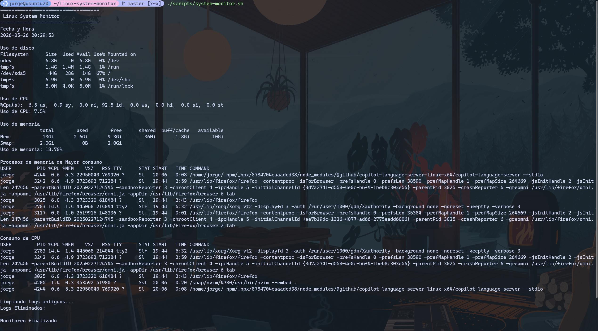

# Linux System Monitor (Sistema de monitoreo de sistema Linux)

Proyecto práctico de DevOps para monitorear recursos básicos de un sistema Linux utilizando Bash.

## Objetivo

Crear un script que nos pueda mostrar información básica del sistema, como fecha y hora, uso de CPU, uso de memoria, espacio en disco, y procesos con mayor consumo.

## Tecnologías Utilizadas

- Linux (Ubuntu)
- Bash (Lenguaje de scripting)
- NeoVim (Editor de texto)
- Git (Control de versiones)
- GitHub (Repositorio remoto)
- Docker (Contenerización)
- Amazon s3 (Almacenamiento de logs)

## Caracteristicas

- Monitoreo de uso de CPU
- Monitoreo de memoria RAM
- Monitoreo de espacio en disco
- Identificación de procesos con mayor consumo de CPU y memoria
- Generación automática de logs
- Limpieza automática de logs antiguos
- Subida de logs a Amazon S3
- Ejecución mediante Docker

## Estructura del proyecto

```text
linux-system-monitor/
├── README.md
├── Dockerfile
├── docker-compose.yml
├── logs/
│   └── system_YYYY-MM-DD.log
├── images/
│   └── preview.png
└── scripts/
    └── system_monitor.sh
```

## Cómo ejecutar el script

1. Clona el repositorio en tu sistema Linux:

```bash
git clone https://github.com/jorgemontess/linux-system-monitor.git
```

2. Navega al directorio del proyecto:

```bash
cd linux-system-monitor
```

3. Da permisos de ejecución al script:

```bash
chmod +x scripts/system_monitor.sh
```

4. Ejecuta el script:

```bash
./scripts/system_monitor.sh
```

## Vista


